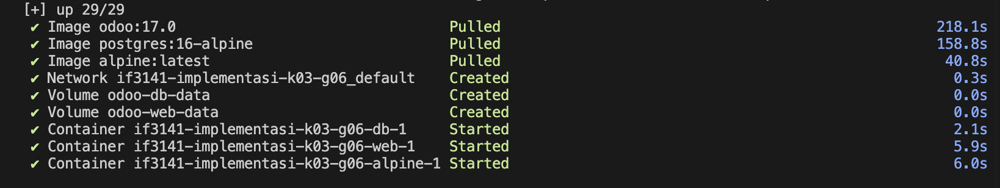
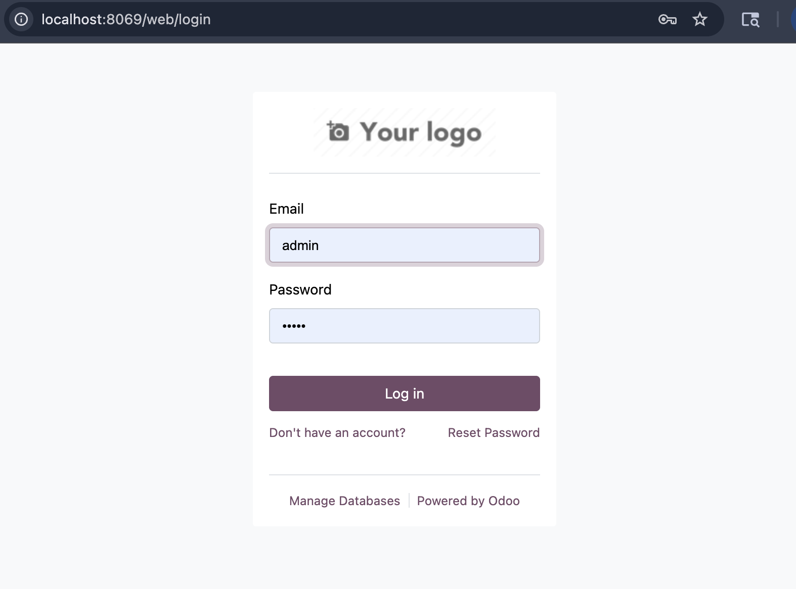

# KYZN Sales Recording System - Kelompok G06 K03

Tugas Besar IF3141 Sistem Informasi - Implementasi Sistem Pencatatan Sales Terpusat

## Informasi Kelompok
- **Nomor Kelompok:** G06
- **Nomor Kelas:** K03
- **Anggota Kelompok:**
  1. 13523134 - Sebastian Enrico Nathanael
  2. 13523140 - Mahesa Fadhillah Andre
  3. 13523142 - Nathanael Rachmat
  4. 13523157 - Natalia Desiany Nursimin
  5. 13523158 - Lukas Raja Agripa
  6. 13523160 - I Made Wiweka Putera

## Deskripsi Sistem
**Nama Sistem:** KYZN Sales Recording System  
**Perusahaan:** PT Akademi Fambam Indonesia (KYZN)

Sistem Pencatatan Sales Terpusat KYZN adalah platform berbasis web yang dibangun menggunakan Odoo Community Edition untuk mengintegrasikan proses pencatatan, validasi, dan pelaporan penjualan membership. Sebelumnya, PT Akademi Fambam Indonesia menghadapi tantangan operasional berupa fragmentasi data karena penggunaan Google Sheets yang terpisah antar cabang, keterlambatan pelaporan kinerja real-time, serta beban administrasi yang tinggi bagi tim sales. Sistem ini hadir sebagai single source of truth yang memastikan seluruh transaksi tercatat secara standar dan dapat dipantau langsung oleh manajemen.

Sistem ini mencakup berbagai modul fungsional, mulai dari formulir pendaftaran membership yang terstandardisasi, alur kerja validasi (Quality Control) oleh Sales Admin, hingga dashboard manajerial untuk melacak KPI penjualan dan tren pembaruan (renewal) anggota. Dengan implementasi sistem ini, KYZN menargetkan peningkatan efisiensi operasional, akurasi data keuangan, dan kemampuan untuk merespons kebutuhan pasar dengan lebih cepat.

## Cara Menjalankan Sistem

### 1. Prerequisites
- **Docker**
- **Python 3.11** (Opsional, untuk pengembangan lokal)

### 2. Menjalankan Service
Buka terminal pada direktori root proyek dan jalankan perintah berikut:

```bash
docker compose up -d
```
> **Expected Result:** Semua container (web dan db) berstatus `running` di Docker Desktop atau melalui perintah `docker ps`.
> 

### 3. Mengakses Aplikasi
Buka browser dan akses alamat berikut:
- **URL:** [http://localhost:8069](http://localhost:8069)
- **Default Master Admin:** `admin` / `admin`

> **Expected Result:** Halaman login Odoo muncul dengan pilihan database yang sesuai.
> 

---

## Kredensial Role
Berikut adalah akun demonstrasi yang dapat digunakan untuk mencoba fungsionalitas tiap role:

| Role | Username (Login) | Password | Deskripsi Akses |
|------|------------------|----------|-----------------|
| **Sales Executive** | `sales.kuningan@kyzn.demo` | `demo` | Input sales order, hanya melihat data sendiri. |
| **Sales Admin** | `sales.admin@kyzn.demo` | `demo` | Validasi sales order, memberikan catatan revisi. |
| **Head of Sales** | `head.sales@kyzn.demo` | `demo` | Melihat dashboard performa, seluruh data sales, & laporan. |
| **Finance / AR** | `finance.ar@kyzn.demo` | `demo` | Read-only sales order yang sudah berstatus *validated*. |
| **IT Support** | `it.support@kyzn.demo` | `demo` | Konfigurasi sistem, manajemen user, dan data master. |
| **Super Admin** | `admin` | `admin` | Akses penuh sistem (Developer Mode). |

---

## Kesimpulan dan Saran
**Kesimpulan:**  
Implementasi sistem pencatatan sales terpusat menggunakan Odoo telah berhasil menjawab permasalahan fragmentasi data di KYZN. Sistem ini menyediakan alur kerja yang terintegrasi antara tim Sales, Admin, dan Finance, sehingga meningkatkan visibilitas data dan akurasi pelaporan secara signifikan.

**Saran:**  
Untuk pengembangan ke depan, disarankan untuk mengintegrasikan sistem ini dengan payment gateway pihak ketiga guna otomatisasi validasi pembayaran secara real-time. Selain itu, penambahan fitur notifikasi otomatis melalui email atau WhatsApp untuk pengingat jadwal follow-up membership dapat lebih meningkatkan retensi pelanggan.
